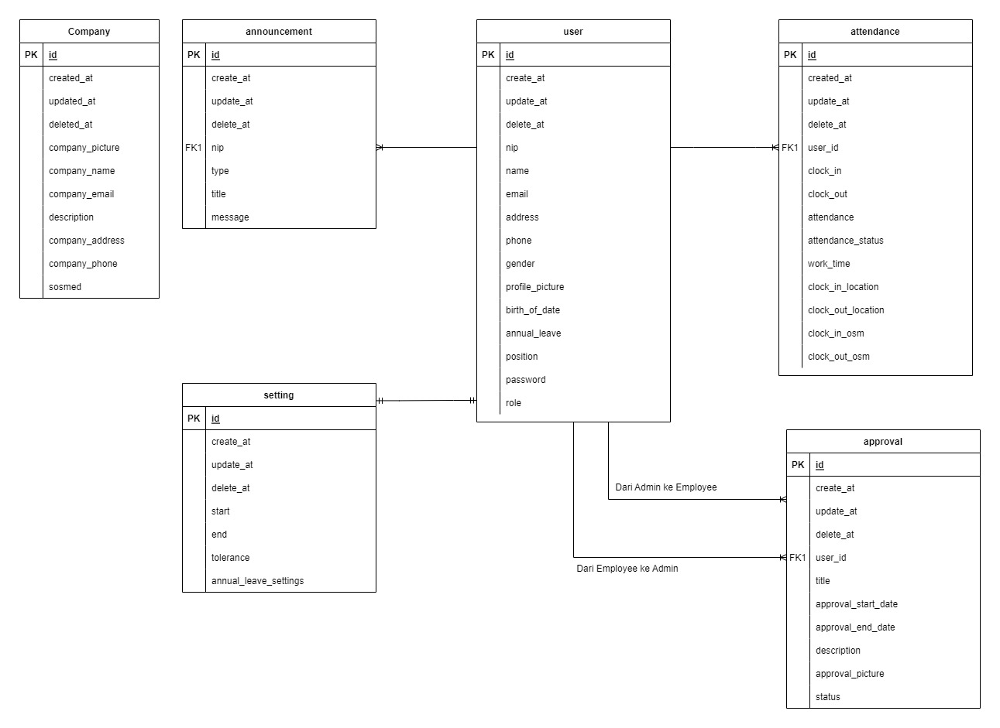

<div align="center">
  <a href="https://github.com/orgs/TIMESYNC-Project/repositories">
    
  </a>

  <p align="center">
    Capstone Program Immersive Alterra Academy
    <br />
    <a href="https://app.swaggerhub.com/apis-docs/fauzilax/TIMESYNC/1.0.0"><strong>| Open API Documentation |</strong></a>
    <br />
    <br />
  </p>
</div>

## 📑 About the Project
<p align="justify">TIMESYNC is an attendance web-app that used by employee to clock-in and clock-out. In this web-app employee can do an approval request for them if they can't attend to office. In order to make sure our app works well and following the requirements, We as a backend engineer build efficient and tested our systems.</p>

## 🛠 Tools
**Backend:** <br>


**Deployment:** <br>


**Communication:**  


# 🔗 ERD


# 🔥 Open API

<details>
  <summary>👶 Admin</summary>
  
| Method      | Endpoint            | Params      |q-Params            | JWT Token   | Function                                |
| ----------- | ------------------- | ----------- |--------------------| ----------- | --------------------------------------- |
| POST        | /register           | -           |-                   | YES         | Register a new employee                 |
| POST        | /register/csv       | -           |-                   | YES         | Register a new employee via csv         |
| POST        | /login              | -           |-                   | NO          | Login to the system                     |
| GET         | /companies          | -           |-                   | YES         | Show company profile                    |
| PUT         | /companies          | -           |-                   | YES         | Update company profile                  |
| GET         | /employees          | -           |-                   | YES         | Get all employee data                   |
| GET         | /employees/{id}     | employee_id |-                   | YES         | get employee profile                    |
| PUT         | /employees/{id}     | employee_id |-                   | YES         | Update employee profile                 |
| DELETE      | /employees/{id}     | employee_id |-                   | YES         | Deactivate employee account             |
| GET         | /setting            | -           |-                   | YES         | Get setting data                        |
| PUT         | /setting            | -           |-                   | YES         | Update setting data                     |
| POST        | /announcements      | -           |-                   | YES         | Post Announcement to employee           |
| GET         | /announcements      | -           |-                   | YES         | Get all Announcements                   |
| DELETE      | /announcements      | announcement_id          |-                   | YES         | Delete Announcements                    |
| GET         | /presences/total    | -           |-                   | YES         | Get total employee presences in a day   |
| POST        | /attendances/{id}   | employee_id |-                   | YES         | Make an attendance for employee         |
| GET         | /approvals          | -           |-                   | YES         | Get all employees approval records      |
| GET        | /approvals/{id}     | approval_id          |-                   | YES         | Get approval details                    |
| PUT       | /approvals/{id}     | approval_id         |-                   | YES         | Update employee approval status         |
| GET         | /graph              | -           |type,year_month,limit        | YES         | Get data for graph                      |
| GET         | /search             | -           |q| YES         | Search for employee name or employee nip|
| GET         | /record/{id}            | employee_id          |-                   | YES         | Get employee attendance record          |
| GET         | /presences/detail/{id}   | presence_id          |-                   | YES         | Get employee presences detail           |
  
</details>

<details>
  <summary>👶 Employee</summary>
  
| Method      | Endpoint            | Params      | JWT Token   | Function                                |
| ----------- | ------------------- | ----------- | ----------- | --------------------------------------- |
| POST        | /login              | -           | NO          | Login to the system                     |
| GET         | /employees/profile   | -    | YES          | Show Employee Profile  |
| PUT         | /employees   | -    | YES          | Update photo and password for employee  |
| GET         | /announcements/{id}   | announcement_id    | YES          | GET announcement detail  |
| GET         | /presences   | -    | YES          | GET total presences in a day per employee  |
| POST         | /attendances   | -    | YES          | Employee Clock In  |
| PUT         | /attendances   | -    | YES          | Employee Clock Out  |
| GET         | /attendances   | -    | YES          | Get Employee Attendances Record  |
| POST         | /approvals              | -           | YES         | Employee can make an approval for permission                    |
| GET         | /employee/approvals              | -           | YES         | GET Employee approvals record                    |
| GET      | /inbox              | -           | YES         | GET inbox message from admin for employee                 |
  
</details>
# 🛠️ How to Run Locally

- Clone it

```
$ git clone https://github.com/TIMESYNC-Project/TIMESYNC-BE
```

- Go to directory

```
$ cd TIMESYNC-BE
```
- Run the project
```
$ go run .
```

- Voila! 🪄

# 🤖 OUR Back End Team

-  Fauzi Sofyan <br>  [](https://github.com/fauzilax)
-  Alif Muhamad Hafidz <br>  [](https://github.com/AlifMuhamadHafidz)

# 🤖 OUR Front End Team

-  Ahmad Zain Azharul Falah <br>  [](https://github.com/zenzett)
-  Aryo Yudhanto <br>  [](https://github.com/aryoyudhanto)

# 🤖 OUR Quality Assurance Team

-  Ichlasiana Amallia <br>  [](https://github.com/ichlasiana)
-  Febrian Syahrir Rizky <br>  [](https://github.com/rizkysyahrir)
-  Dona Putra Por <br>  [](https://github.com/donaputra)
-  Rico Rinaldi <br>  [](https://github.com/RicoRinaldi93)

<h5>
<p align="center">Built with ❤️ by Timesync Team ©️ 2023</p>
</h5>
